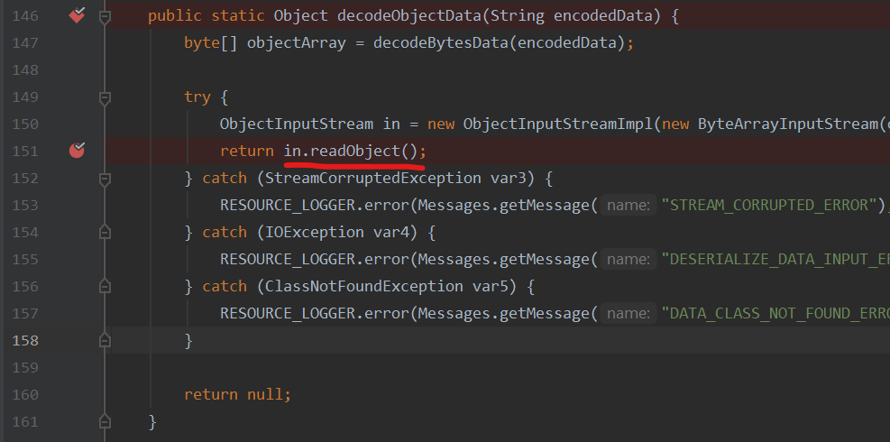
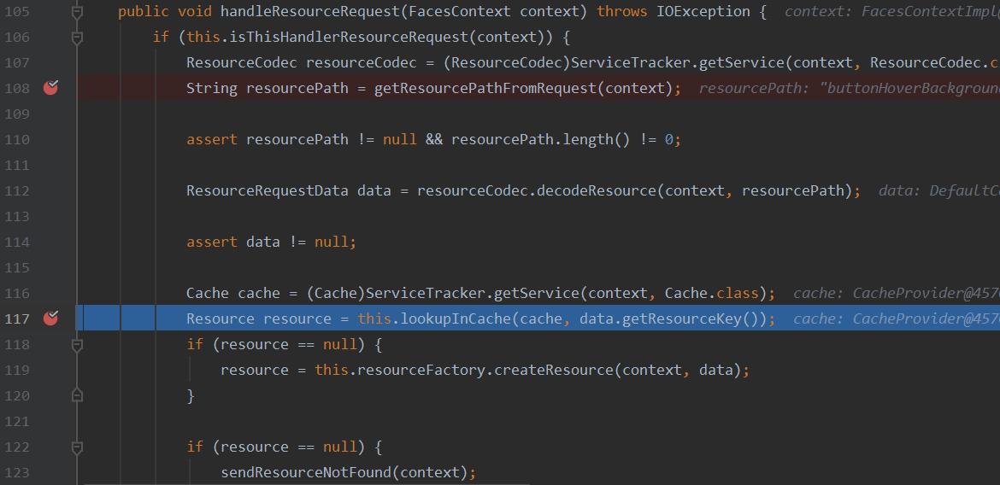
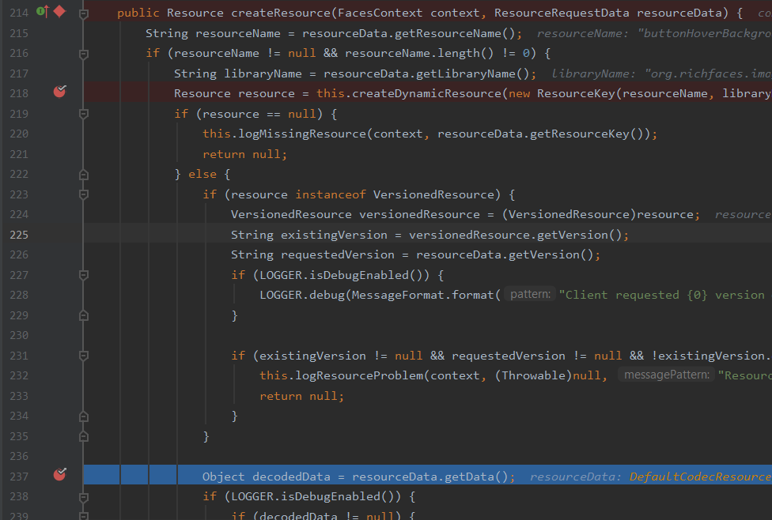
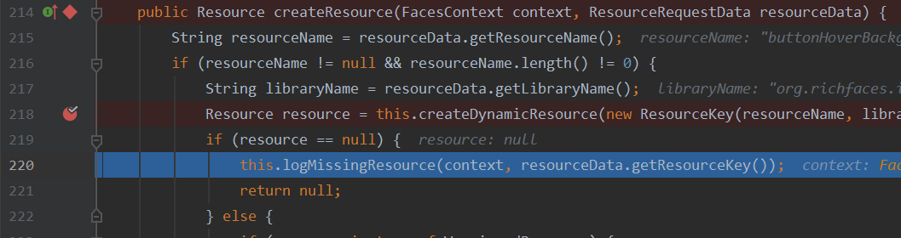
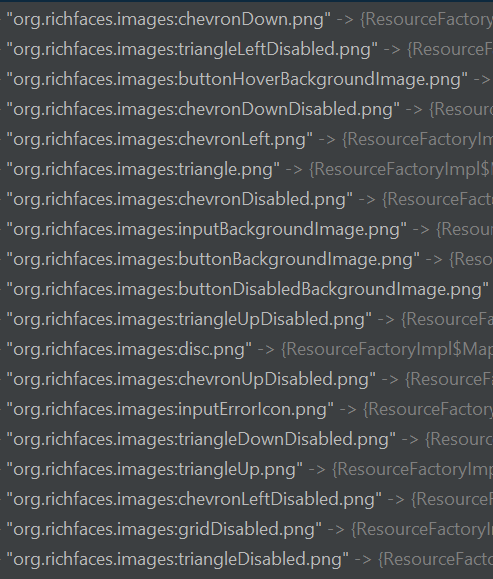
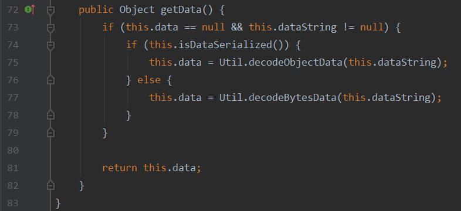
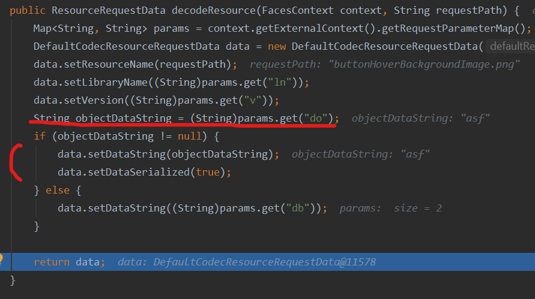
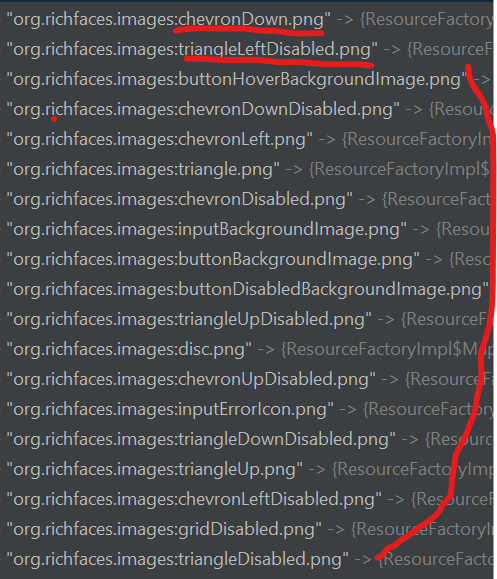
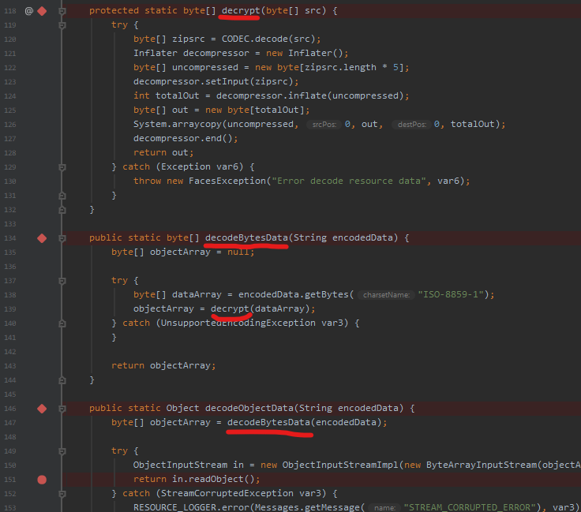
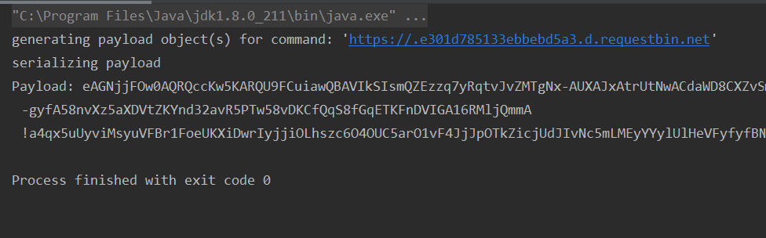

## CVE-2013-2165

Author: lamnc2

Github: [kiven7299](https://github.com/kiven7299)


### Description

> ResourceBuilderImpl.java in the RichFaces 3.x through 5.x implementation in Red Hat JBoss Web Framework Kit before 2.3.0, Red Hat JBoss Web Platform through 5.2.0, Red Hat JBoss Enterprise Application Platform through 4.3.0 CP10 and 5.x through 5.2.0, Red Hat JBoss BRMS through 5.3.1, Red Hat JBoss SOA Platform through 4.3.0 CP05 and 5.x through 5.3.1, Red Hat JBoss Portal through 4.3 CP07 and 5.x through 5.2.2, and Red Hat JBoss Operations Network through 2.4.2 and 3.x through 3.1.2 does not restrict the classes for which deserialization methods can be called, which allows remote attackers to execute arbitrary code via crafted serialized data.
>
> [nvd.nist.gov](https://nvd.nist.gov/vuln/detail/CVE-2013-2165)


### Find vulnerable entry point

As a method provided by [@tint0](https://blog.tint0.com/)

> Getting some info about the CVE through the Richfaces developer’s blog at [http://www.bleathem.ca/blog/richfaces-security-advisory-cve-2013-2165/](https://web.archive.org/web/20190501081457/http://www.bleathem.ca/blog/richfaces-security-advisory-cve-2013-2165/) and see that the bug is fixed in Richfaces 4.3.3.
>
> Make a [diff](https://web.archive.org/web/20190501081457/https://github.com/richfaces4/core/compare/4.3.2.20130513-Final...4.3.3.20130710-Final) between the two Richfaces 4.3.3 and 4.3.2 to find the vulnerable code. We could see that the only difference in the diff is a code change fixing deserialization issue.


The vulnerability is located in `org.RichFacess.util.Util#DecodeObjectData`:




### Reach the vulnerable entry point

#### Examine data flow

1. Requests for resources always pass through `org.RichFacess.resource.ResourceHandlerImpl#handleResourceRequest`

   *(Don't know why yet)*

   

   

   1. **Line 108** calls `org.RichFacess.resource.ResourceHandlerImpl#getResourcePathFromRequest`

      ```java
      public static String getResourcePathFromRequest(FacesContext context) {
              String resourceName = Util.decodeResourceURL(context);
              if (resourceName != null) {
                  return resourceName.startsWith("/rfRes/") ? resourceName.substring("/rfRes/".length()) : null;
              } else {
                  LOGGER.warn("Resource key not found" + resourceName);
                  return null;
              }
          }
      ```

      <u>**Requirement 1**:</u> Uri for resource in format `/rfRes/<resource name>`

      

   2. **Line 119** calls `org.RichFacess.resource.ResourceFactoryImpl#createReource` if the `resource` variable is null -  doesn't exist in cache (it usually doesn't). 

      

      1. **Line 218** calls `org.RichFacess.resource.ResourceFactoryImpl#createDynamicResoure`

         <u>**Requirement 2**</u>: The resource name provided in uri as `/rfRes/<resource name>` **must exist**.

         

         Look at the method, we can see that it use `libraryName` and `resourceName` to check whether it matches a key in `ResourceFactoryImpl.mappedResourceDataMap`:

         

         - `resourceName` is `<resource name>`

         - `libraryName` is the value of parameter `ln`.

           <u>**Requirement 3:**</u>  provide parameter `ln=org.richfaces.images`

           So as to have existed resource, we can provide `/chevronDown.png.jsf?ln=org.richfaces.images`.

         

      2. **Line 237**. Method `org.RichFacess.resource.DefaultCodecResourceRequestData#getData` check if `this.isDataSerialized` is true, then call `Util#decodeObjectData`, which is **the vulnerable entry point**.

         

         Values for `isDataSerialized` and `dataString` are set by below function which is called in line 112 of  `org.RichFacess.resource.ResourceHandlerImpl#handleResourceRequest`:

         

         

         

      **<u>Requirement 4</u>:** Provide parameter `do=<serialized data>`

      

#### Conclusion

Requirements:

- Uri must be in format `/rfRes/<resource name>`

  - `<resoure name>` can be one of these (and more):

    

  

- Provide parameter `ln=org.richfaces.images`

- Provide parameter `do=<serialized data>`

Payload:

```
/rfRes/chevronDown.png.jsf?ln=org.richfaces.images&do=<serialied object payload>
```


### Exploit

#### Craft payload

In JBoss RichFaces 's deserialization procedure, there is a decryption phrase



This means the string representing serialized object is encrypted; Thus, we have to perform appropriate method of encryption. Fortunately, `org.richfaces.util.Util` class defines the encrypting functions so that we can reuse them.

```java
protected static byte[] encrypt(byte[] src) {
        try {
            Deflater compressor = new Deflater(1);
            byte[] compressed = new byte[src.length + 100];
            compressor.setInput(src);
            compressor.finish();
            int totalOut = compressor.deflate(compressed);
            byte[] zipsrc = new byte[totalOut];
            System.arraycopy(compressed, 0, zipsrc, 0, totalOut);
            compressor.end();
            return CODEC.encode(zipsrc);
        } catch (Exception var5) {
            throw new FacesException("Error encode resource data", var5);
        }
    }
    
public static String encodeBytesData(byte[] data) {
        if (data != null) {
            try {
                byte[] dataArray = encrypt(data);
                return new String(dataArray, "ISO-8859-1");
            } catch (Exception var2) {
                RESOURCE_LOGGER.error(Messages.getMessage("QUERY_STRING_BUILDING_ERROR"), var2);
            }
        }

        return null;
    }
```


In terms of exploiting Insecure Deserialization, we use **URLDNS** chain consulted from [ysoserial](https://github.com/frohoff/ysoserial). This chain exploit deserialization vulnerability to make `url` request:

>  // DNS Gadget Chain:
> 	java.util.HashMap.readObject()
> 		java.util.HashMap.putVal( HashMap.hash() )
>  			java.net.URL.hashCode(String url)


Code for generating payload: 

https://github.com/kiven7299/Java-Deserialization/blob/master/CVE-2013-2165/payload_generator/src/main/java/PayloadGenerator.java


Snapshot:




#### PoC

https://drive.google.com/open?id=1Nd1sjFW731cMffUiBgl_UtOMJQV5UFaJ